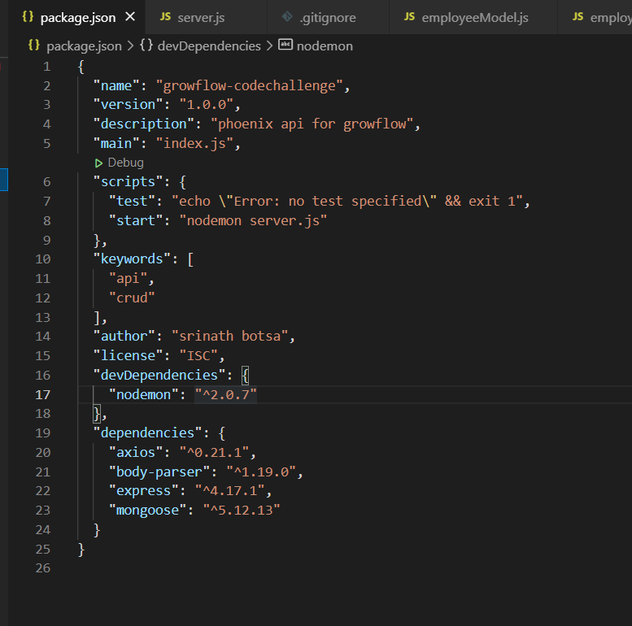
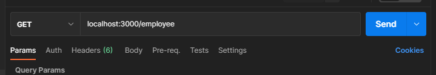
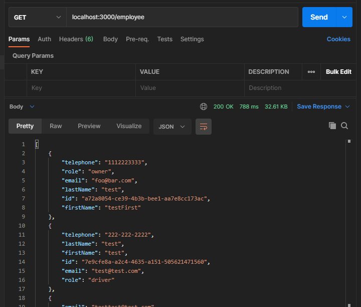
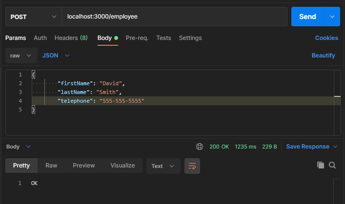
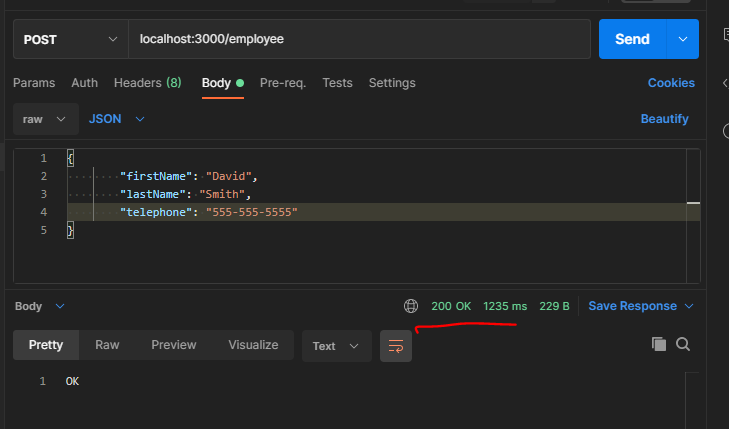

# PHOENIX

A REST API named **'Phoenix'** created in **NodeJS** framework  that can perform CRUD operatioons .

### How to run this application locally ?

On your local machine you must have **NodeJS** installed before starting to run.Follow this [link](https://nodejs.dev/learn/how-to-install-nodejs) for Node installation.

- Clone or download the repo on to your local machine

```
git clone https://github.com/bsrinath9/growflow.git
```
- Open the folder **growflow** in an IDE of your choice ( VSCode/Atom/Sublime Text or any other)

- Run ```npm init ``` , you would get a *package.json* file similar to the file below 

  

- Install "Express,body-parser,axios and nodemon" using the commands

  ```
  npm install express
  npm install body-parser
  npm install axios
  npm install nodemon
  ```
- Add below line to "scripts" in *package.json*
```javascript
"start":"nodemon server.js"
``` 
- Now run ```npm start```on the terminal and open a browser and navigate to http:\\localhost:3000

### Testing via Postman

Postman is a very useful tool to test APIs and it's absolutely FREE !. Follow this [link](https://learning.postman.com/docs/getting-started/installation-and-updates/) to install postman on  your local machine.

- Once installed, open postman and run this request **GET** request and hit **SEND** button

  

- You should get an output like below



-Now run **POST** request as shown below



You would get an output like below




